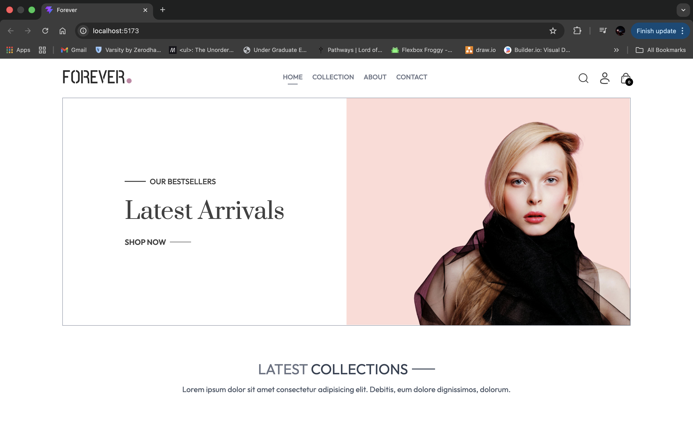
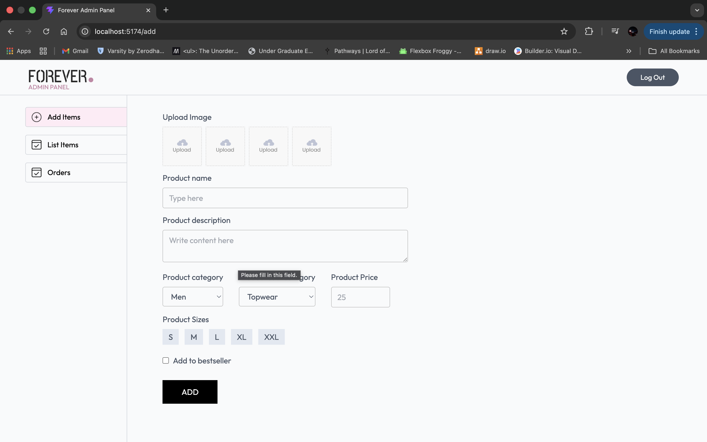
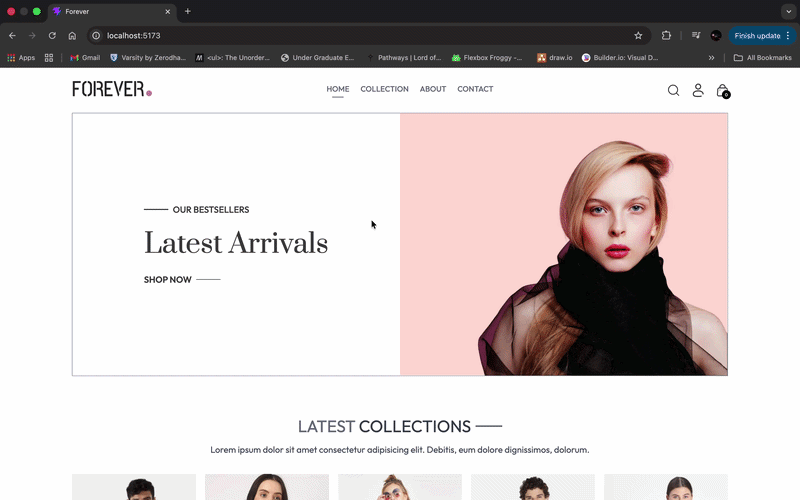

# E-Commerce Website

A full-stack e-commerce application with a modern React frontend, admin dashboard, and Node.js backend with MongoDB.

## Features

### Customer Features
- **Product Browsing**: Browse and search products with filtering options
- **Shopping Cart**: Add/remove items and manage cart
- **User Authentication**: Secure login and registration with JWT
- **Order Management**: Place orders and track order history
- **Payment Integration**: Multiple payment gateways (Stripe, Razorpay)
- **Responsive Design**: Works seamlessly on desktop, tablet, and mobile

### Admin Features
- **Product Management**: Add, edit, and delete products
- **Inventory Management**: Manage product stock
- **Order Management**: View and manage customer orders
- **Image Management**: Upload and manage product images with Cloudinary

## Screenshots & Demo

### Customer Frontend


### Admin Dashboard


### Demo Video/GIF


## Tech Stack

### Frontend
- **Framework**: React 19 with Vite
- **Styling**: Tailwind CSS
- **Routing**: React Router v7
- **HTTP Client**: Axios
- **Notifications**: React Toastify

### Admin Dashboard
- **Framework**: React 19 with Vite
- **Styling**: Tailwind CSS
- **Routing**: React Router v7
- **HTTP Client**: Axios

### Backend
- **Runtime**: Node.js
- **Framework**: Express.js
- **Database**: MongoDB with Mongoose
- **Authentication**: JWT with Bcrypt
- **File Upload**: Multer
- **Image Storage**: Cloudinary
- **Payment**: Stripe & Razorpay
- **CORS**: Enabled for cross-origin requests

## Project Structure

```
├── admin/                    # Admin dashboard application
│   ├── src/
│   │   ├── components/      # UI components
│   │   ├── pages/           # Admin pages
│   │   └── App.jsx
│   └── package.json
├── frontend/                 # Customer-facing frontend
│   ├── src/
│   │   ├── components/      # Reusable components
│   │   ├── pages/           # Page components
│   │   ├── context/         # React context (ShopContext)
│   │   └── App.jsx
│   └── package.json
├── backend/                  # Node.js backend API
│   ├── config/              # Database & Cloudinary config
│   ├── controllers/         # Route controllers
│   ├── middleware/          # Auth & file upload middleware
│   ├── models/              # Mongoose schemas
│   ├── routes/              # API routes
│   ├── server.js
│   └── package.json
└── README.md
```

## Getting Started

### Prerequisites
- Node.js (v14 or higher)
- npm or yarn
- MongoDB instance (local or MongoDB Atlas)
- Cloudinary account (for image uploads)
- Stripe and/or Razorpay account (for payments)

### Installation

1. **Clone the repository**
   ```bash
   git clone <repository-url>
   cd Ecommerce\ website
   ```

2. **Backend Setup**
   ```bash
   cd backend
   npm install
   ```

3. **Frontend Setup**
   ```bash
   cd ../frontend
   npm install
   ```

4. **Admin Dashboard Setup**
   ```bash
   cd ../admin
   npm install
   ```

### Environment Configuration

Create a `.env` file in the `backend` directory:

```env
# Server
PORT=4000

# Database
MONGODB_URI=mongodb+srv://<username>:<password>@<cluster>.mongodb.net/<database>

# Cloudinary
CLOUDINARY_NAME=your_cloudinary_name
CLOUDINARY_API_KEY=your_cloudinary_api_key
CLOUDINARY_SECRET_KEY=your_cloudinary_secret_key

# JWT
JWT_SECRET=your_jwt_secret_key

# Payment Gateways
STRIPE_SECRET_KEY=your_stripe_secret_key
RAZORPAY_KEY_ID=your_razorpay_key_id
RAZORPAY_KEY_SECRET=your_razorpay_key_secret
```

For frontend and admin dashboard, create `.env.local` files if needed for API endpoints:

```env
VITE_API_URL=http://localhost:4000
```

## Running the Application

### Start Backend Server

```bash
cd backend
npm run server    # Uses nodemon for development with auto-reload
# or
npm start         # Regular start
```

The API will be available at `http://localhost:4000`

### Start Frontend Application

```bash
cd frontend
npm run dev
```

The frontend will be available at `http://localhost:5173`

### Start Admin Dashboard

```bash
cd admin
npm run dev
```

The admin dashboard will be available at `http://localhost:5174`

## API Endpoints

### User Routes (`/api/user`)
- `POST /register` - User registration
- `POST /login` - User login
- `GET /verify` - Verify authentication token

### Product Routes (`/api/product`)
- `GET /list` - Get all products
- `POST /add` - Add new product (admin only)
- `POST /remove` - Remove product (admin only)
- `POST /update` - Update product (admin only)

### Cart Routes (`/api/cart`)
- `POST /add` - Add item to cart
- `POST /remove` - Remove item from cart
- `GET /get` - Get user cart

### Order Routes
- `POST /place` - Place new order
- `GET /list` - Get user orders

## Development

### Build for Production

**Frontend:**
```bash
cd frontend
npm run build
```

**Admin Dashboard:**
```bash
cd admin
npm run build
```

### Code Linting

```bash
# Frontend
cd frontend && npm run lint

# Admin
cd admin && npm run lint
```

## Features in Detail

### Authentication
- Secure user registration and login
- JWT-based authentication
- Password encryption with Bcrypt
- Protected admin routes

### Payment Processing
- Stripe integration for credit/debit cards
- Razorpay integration for UPI and local payments
- Secure payment handling

### Image Management
- Upload images via Cloudinary
- Automatic image optimization
- Support for multiple product images

### Cart Management
- Persistent cart storage
- Real-time cart updates
- Cart total calculations

## Project Status

This project is under active development. Core features for customer shopping and basic admin management are implemented.

## Support

For issues, questions, or contributions, please refer to the respective component documentation or contact the development team.
